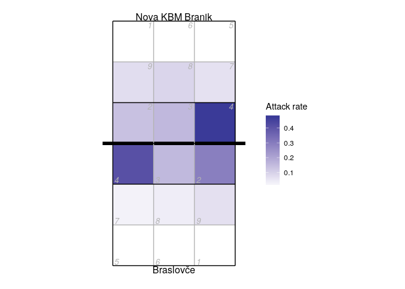
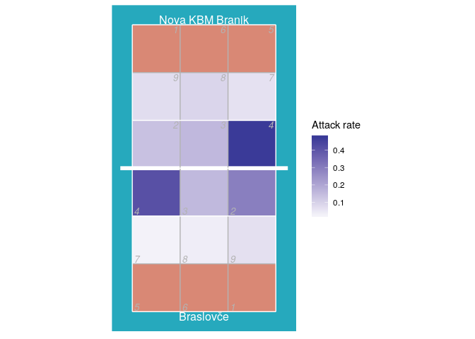
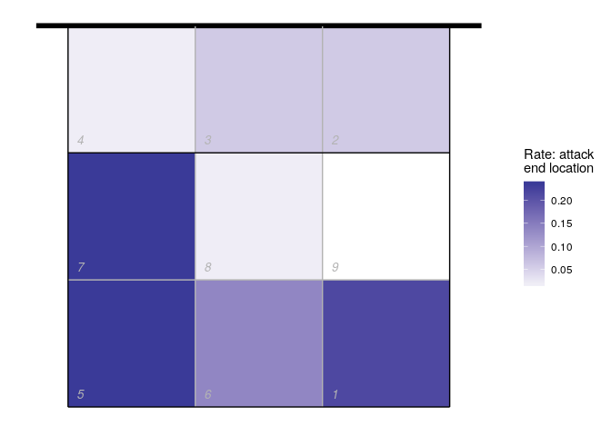
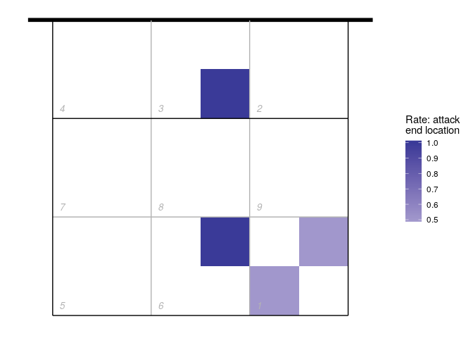
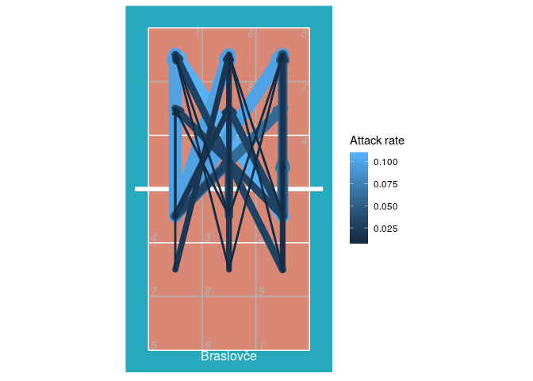
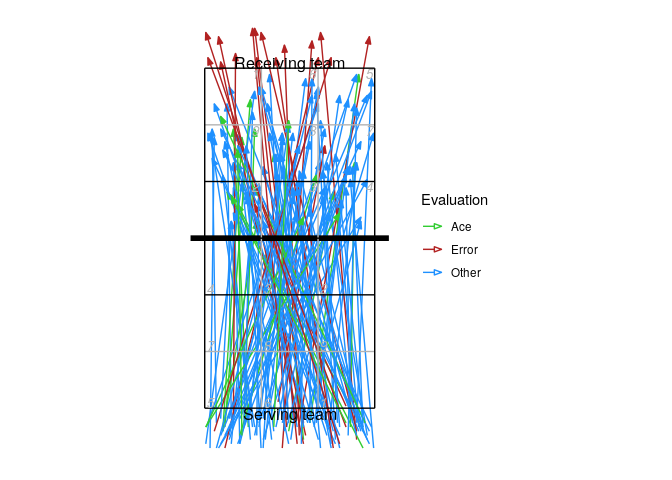
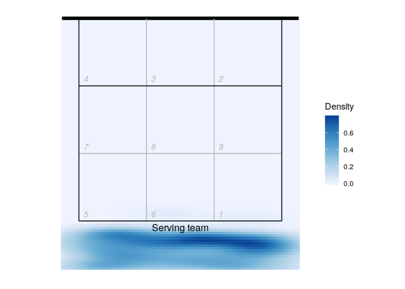

<!-- README.md is generated from README.Rmd. Please edit that file -->

# datavolley

[](https://travis-ci.org/openvolley/datavolley)
[](https://www.tidyverse.org/lifecycle/#stable)
![openvolley](https://img.shields.io/badge/openvolley-darkblue.svg?logo=)


An R package for reading DataVolley scouting files.

See also this [DataVolley file
validator](https://apps.untan.gl/dvalidate/) and [suite of analytical
apps](https://apps.untan.gl/), which are built on the datavolley
package.

The [peranavolley](https://github.com/openvolley/peranavolley) package
provides similar functionality for reading files scouted by the [AOC
VBStats](http://peranasports.com/software/vbstatshd/) software.

**NOTE:** recent updates have included substantial changes to the way
that text encoding is handled, including the way that the correct
encoding is guessed with `read_dv(..., text_encoding = "guess")`. Text
encoding should work better now, particular on Windows. Please [submit
an issue](https://github.com/openvolley/datavolley/issues/new) if you
find problems related to text encoding (e.g. player or team names not
displaying correctly).

## Installation

``` r
library(remotes)
install_github("openvolley/datavolley")
```

## Example

Read one of the example data files bundled with the package:

``` r
library(datavolley)
x <- read_dv(dv_example_file(), insert_technical_timeouts = FALSE)
summary(x)
#> Match summary:
#> Date: 2015-01-25
#> League: Finale mladinke
#> Teams: Braslovče (JERONČIČ ZORAN/MIHALINEC DAMIJANA)
#>        vs
#>        Nova KBM Branik (HAFNER MATJAŽ)
#> Result: 3-0 (25-16, 25-14, 25-22)
#> Duration: 67 minutes
```

Note that if you are working with files that were scouted by
VolleyMetrics, they use some conventions in their files that differ from
standard DataVolley usage. There is an option to tell `read_dv` to
follow their conventions:

``` r
x <- read_dv("/your/file.dvw", skill_evaluation_decode = "volleymetrics")
```

Number of serves by team:

``` r
serve_idx <- find_serves(plays(x))
table(plays(x)$team[serve_idx])
#> 
#>       Braslovče Nova KBM Branik 
#>              74              54
```

Distribution of serve run lengths:

``` r
serve_run_info <- find_runs(plays(x)[serve_idx, ])
table(unique(serve_run_info[, c("run_id", "run_length")])$run_length)
#> 
#>  1  2  3  4  5  7  8 
#> 34 16  7  4  1  1  1
```

The court position associated with each action can be recorded in two
ways. The most common is by zones (numbered 1-9).

Heatmap of attack rate by court zone (where the attack was made from):

``` r
library(ggplot2)
library(dplyr)
## calculate attack frequency by zone, per team
attack_rate <- plays(x) %>% dplyr::filter(skill == "Attack") %>%
    group_by(team, start_zone) %>% dplyr::summarize(n_attacks = n()) %>%
    mutate(rate = n_attacks/sum(n_attacks)) %>% ungroup

## add x, y coordinates associated with the zones
attack_rate <- cbind(attack_rate, dv_xy(attack_rate$start_zone, end = "lower"))

## for team 2, these need to be on the top half of the diagram
tm2i <- attack_rate$team == teams(x)[2]
attack_rate[tm2i, c("x", "y")] <- dv_flip_xy(attack_rate[tm2i, c("x", "y")])

ggplot(attack_rate, aes(x, y, fill = rate)) + geom_tile() + ggcourt(labels = teams(x)) +
    scale_fill_gradient2(name = "Attack rate")
```

<!-- -->

If you prefer a more colourful court, check the `court_colour =
"indoor"` option. Note that we make two calls to `ggcourt` in this
example, one with `background_only = TRUE` to plot just the court
background colours, and again with `foreground_only = TRUE` to add the
grid lines and labels. Making two calls allows us to control the layer
order, so that the court colours are behind the heatmap, but the grid
lines are on top of it:

``` r
ggplot(attack_rate, aes(x, y, fill = rate)) +
    ## plot just the background court colour
    ggcourt(court_colour = "indoor", background_only = TRUE) +
    ## add the heatmap
    geom_tile() +
    ## now add the grid lines and labels
    ggcourt(labels = teams(x), court_colour = "indoor", foreground_only = TRUE) +
    scale_fill_gradient2(name = "Attack rate")
```

<!-- -->

Heatmap of where attacks ended, using only attacks by Nova KBM Branik
from position 4:

``` r
## calculate attack frequency by zone, per team
attack_rate <- plays(x) %>% 
    dplyr::filter(team == "Nova KBM Branik" & skill == "Attack" & start_zone == 4) %>%
    group_by(end_zone) %>% dplyr::summarize(n_attacks = n()) %>%
    mutate(rate = n_attacks/sum(n_attacks)) %>% ungroup
attack_rate <- cbind(attack_rate, dv_xy(attack_rate$end_zone, end = "lower"))
ggplot(attack_rate, aes(x, y, fill = rate)) + geom_tile() + ggcourt("lower", labels = NULL) +
    scale_fill_gradient2(name = "Rate: attack\nend location")
#> Warning: Removed 1 rows containing missing values (geom_tile).
```

<!-- -->

We can also use the end subzone information, if it has been recorded.
The subzones divide each zone into four, so we get higher spatial
resolution (but the subzone is not always scouted). The same plot as
above, but using subzones:

``` r
attack_rate <- plays(x) %>% 
    dplyr::filter(team != "Nova KBM Branik" & skill == "Attack" & start_zone == 4 & !is.na(end_subzone)) %>%
    group_by(end_zone, end_subzone) %>% dplyr::summarize(n_attacks = n()) %>%
    mutate(rate = n_attacks/sum(n_attacks)) %>% ungroup
attack_rate <- cbind(attack_rate, dv_xy(attack_rate$end_zone, end = "lower", subzones = attack_rate$end_subzone))
ggplot(attack_rate, aes(x, y, fill = rate)) + geom_tile() + ggcourt("lower", labels = NULL) +
    scale_fill_gradient2(name = "Rate: attack\nend location")
```

<!-- -->

Or using arrows to show the starting and ending zones of attacks:

``` r
## first tabulate attacks by starting and ending zone
attack_rate <- plays(x) %>% dplyr::filter(team == teams(x)[1] & skill == "Attack") %>%
  group_by(start_zone, end_zone) %>% tally() %>% ungroup

## convert counts to rates
attack_rate$rate <- attack_rate$n/sum(attack_rate$n)

## discard zones with zero attacks or missing location information
attack_rate <- attack_rate %>% dplyr::filter(rate>0 & !is.na(start_zone) & !is.na(end_zone))

## add starting x, y coordinates
attack_rate <- cbind(attack_rate, dv_xy(attack_rate$start_zone, end = "lower", xynames = c("sx", "sy")))

## and ending x, y coordinates
attack_rate <- cbind(attack_rate, dv_xy(attack_rate$end_zone, end = "upper", xynames = c("ex", "ey")))

## plot in reverse order so largest arrows are on the bottom
attack_rate <- attack_rate %>% dplyr::arrange(desc(rate))

p <- ggplot(attack_rate, aes(x, y, col = rate)) + ggcourt(labels = c(teams(x)[1], ""), court_colour = "indoor")
for (n in 1:nrow(attack_rate))
    p <- p + geom_path(data = data.frame(x = c(attack_rate$sx[n], attack_rate$ex[n]),
                                         y = c(attack_rate$sy[n], attack_rate$ey[n]),
                                         rate = attack_rate$rate[n]),
                       aes(size = rate), lineend = "round",
                       arrow = arrow(length = unit(2, "mm"), type = "closed", angle = 20, ends = "last"))
p + scale_colour_gradient(name = "Attack rate") + guides(size = "none")
```

<!-- -->

Another source of position data is court coordinates. These are not
included in all data files, because generally they must be manually
entered by the scout and this can be a time consuming process. For the
purposes of demonstration, here we generate fake coordinate data:

``` r
## take just the serves from the play-by-play data
xserves <- subset(plays(x), skill == "Serve")

## if the file had been scouted with coordinate included, we could plot them directly
## this file has no coordinates, so we'll fake some up for demo purposes
coords <- dv_fake_coordinates("serve", xserves$evaluation)
xserves[, c("start_coordinate", "start_coordinate_x", "start_coordinate_y",
            "end_coordinate", "end_coordinate_x", "end_coordinate_y")] <- coords

## now we can plot these
xserves$evaluation[!xserves$evaluation %in% c("Ace", "Error")] <- "Other"

ggplot(xserves, aes(start_coordinate_x, start_coordinate_y,
       xend = end_coordinate_x, yend = end_coordinate_y, colour = evaluation)) +
    geom_segment(arrow = arrow(length = unit(2, "mm"), type = "closed", angle = 20)) +
    scale_colour_manual(values = c(Ace = "limegreen", Error = "firebrick", Other = "dodgerblue"),
                        name = "Evaluation") +
    ggcourt(labels = c("Serving team", "Receiving team"))
```

<!-- -->

We could also use these coordinates to generate a heatmap-style plot of
serve location:

``` r
ggplot(xserves, aes(start_coordinate_x, start_coordinate_y)) +
    stat_density_2d(geom = "raster", aes(fill = ..density..), contour = FALSE) +
    scale_fill_distiller(palette = 1, direction = 1, name = "Density") +
    ggcourt("lower", labels = "Serving team")
```

<!-- -->

### Analyzing multiple files at once

You might want to read multiple files in and analyze them all together.
First find all of the DataVolley files in the target directory:

``` r
d <- dir("c:/data", pattern = "dvw$", full.names = TRUE)
## if your files are in nested directories, add 'recursive = TRUE' to the arguments
```

Read all of those files in a loop, extract the play-by-play component
from each, and then join of those all together:

``` r
lx <- list()
for (fi in seq_along(d)) lx[[fi]] <- plays(read_dv(d[fi]))
px <- do.call(rbind, lx)
```

(Note, the idiomatic R way to do this would be to use `lapply` instead
of a `for` loop:

``` r
lx <- lapply(d, read_dv)
px <- do.call(rbind, lapply(lx, plays))
```

It achieves the same thing. Use whichever you prefer.)

And then we could get dataset-wide statistics, for example reception
error rate by team:

``` r
library(dplyr)
px %>% dplyr::filter(skill == "Reception") %>% group_by(team) %>% 
  dplyr::summarize(N_receptions = n(), error_rate = mean(evaluation == "Error", na.rm = TRUE))
#> # A tibble: 8 x 3
#>   team            N_receptions error_rate
#>   <chr>                  <int>      <dbl>
#> 1 ACH Volley                32     0.0312
#> 2 Aich/Dob                  86     0.0233
#> 3 Br.Maribor                61     0.0328
#> 4 Braslovče                103     0.233 
#> 5 Hypo Tirol                98     0.0816
#> 6 Kamnik                    69     0.0290
#> 7 Maribor                   64     0.188 
#> 8 Nova KBM Branik          153     0.131
```

## Troubleshooting

If you see unexpected behaviour, try `read_dv(..., do_warn = TRUE)` to
obtain more diagnostic information during the process of reading and
parsing the DataVolley file. Also check the text encoding specified to
`read_dv` (did you specify one??)

## More

For more information about DataVolley, see
<http://www.dataproject.com/IT/en/Volleyball>.
